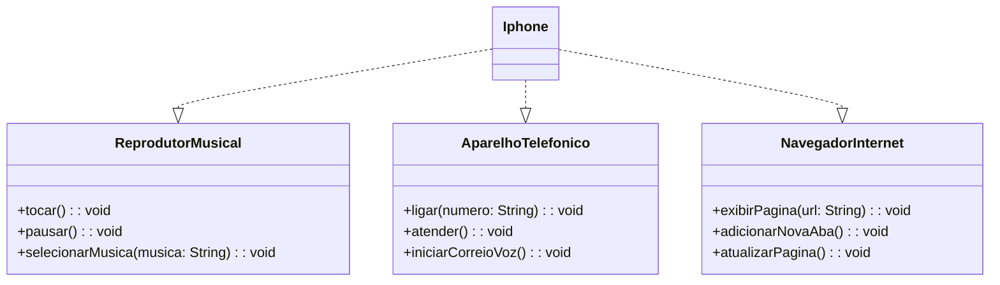

# 📱 Simulador de iPhone (Java + UML)

Este projeto simula o comportamento básico de um iPhone de acordo com a apresentação original de 2007, implementando suas três principais funcionalidades: **Reprodutor Musical**, **Aparelho Telefônico** e **Navegador de Internet**.

## 📋 Descrição do Projeto

Com base nas funcionalidades demonstradas por Steve Jobs no lançamento do iPhone, este projeto modela e implementa uma estrutura orientada a objetos utilizando **interfaces e classes** em Java.

## 📐 Diagrama UML (Mermaid)



## 💻 Funcionalidades

### 🎵 Reprodutor Musical
- `selecionarMusica(String musica)`: permite escolher uma música pelo nome.
- `tocar()`: inicia a reprodução da música selecionada.
- `pausar()`: pausa a música que está sendo tocada.

### 📞 Aparelho Telefônico
- `ligar(String numero)`: simula uma ligação para o número informado.
- `atender()`: simula o atendimento de uma chamada.
- `iniciarCorreioVoz()`: simula o início do correio de voz.

### 🌐 Navegador de Internet
- `exibirPagina(String url)`: abre uma página informando a URL.
- `adicionarNovaAba()`: simula a criação de uma nova aba de navegação.
- `atualizarPagina()`: simula a atualização da aba atual.

## 🧠 Tecnologias Utilizadas

- Java 21+
- Paradigma de Programação Orientada a Objetos (POO)
- Scanner para entrada de dados
- UML com Mermaid (para diagramação)

## ▶️ Como Executar

1. Clone este repositório:
   ```bash
   git clone https://github.com/seu-usuario/simulador-iphone.git
   ```

2. Compile os arquivos `.java`:
   ```bash
   javac *.java
   ```

3. Execute o programa:
   ```bash
   java Main
   ```

## 👤 Autor

Desenvolvido por **Victor Hugo Dutra Ferreira** — Projeto educacional com fins de prática em Java e modelagem UML.
